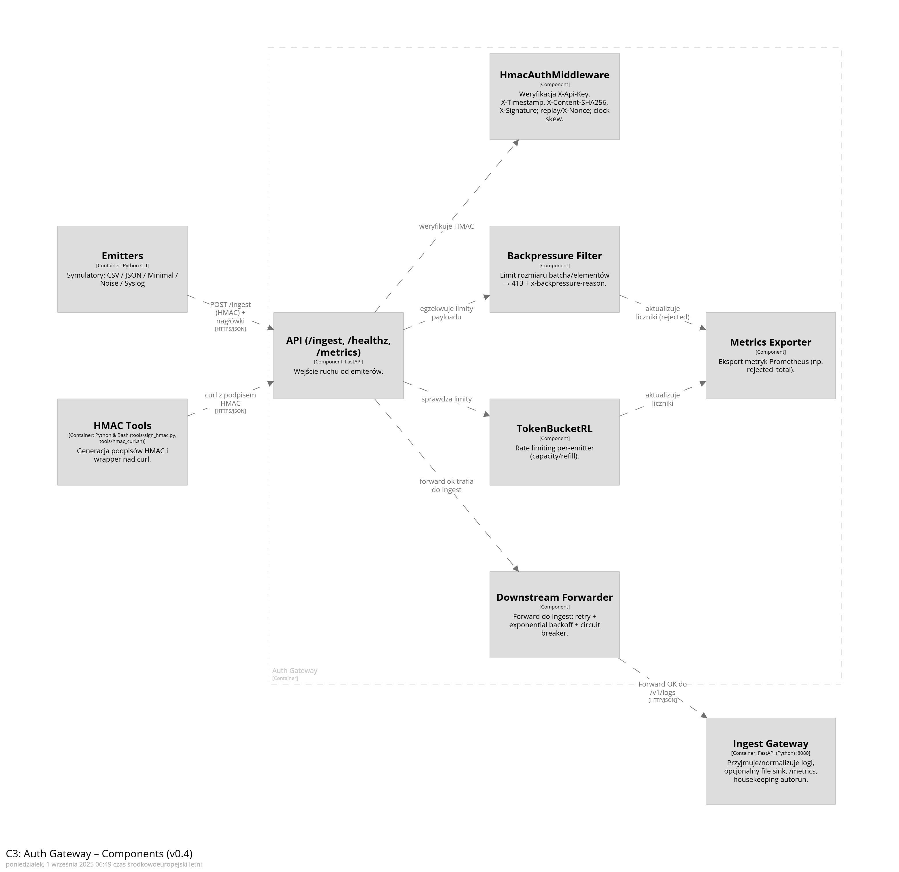
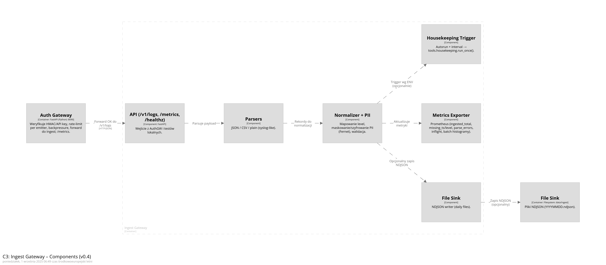

# Architektura LogOps (v0.5)

Dokument opisuje architekturę systemu LogOps w ujęciu **C4 modelu**.
Diagramy są definiowane w [Structurizr DSL](https://structurizr.com/dsl) i uruchamiane lokalnie przez obraz `structurizr/lite`.

**Nowości v0.5 (vs v0.4):**
- **Scenario Orchestrator API** (FastAPI) – prosty control-plane do start/stop/list scenariuszy (+ `tools/orch_cli.py`).
- **Oddzielony Core** (opcjonalny serwis) – miejsce na dalsze przetwarzanie poza Ingest.
- **Narzędzia HMAC**: dodany `tools/verify_hmac_against_signer.py` (walidacja sygnatur vs `sign_hmac.py`).
- Uporządkowany DSL i **nowa paleta styli** diagramów (spójna z repo).

---

## C1: System Context

Aktorzy i systemy zewnętrzne:

- **Developer** uruchamia emitery lub całe scenariusze (CLI/HTTP Orchestratora).
- **Grafana User** obserwuje logi (Loki) i metryki (Prometheus); reaguje na alerty (Alertmanager).
- Przepływ: *Emitery → AuthGW (HMAC/RL/backpressure) → IngestGW (normalizacja/PII) → File sink → Promtail/Loki; metryki → Prometheus/Alertmanager; wizualizacja → Grafana.*

**Diagram C1:**


---

## C2: Containers

Widok kontenerów w LogOps (v0.5):

- **Scenario Orchestrator API** – HTTP `/scenario/start|stop|list`, uruchamia runner, nadaje `scenario_id`.
- **Emitters** – generatory ruchu: CSV / JSON / Minimal / Noise / Syslog (CLI).
- **Auth Gateway** – weryfikacja HMAC/API key, **rate limiting** (token bucket), **backpressure** (413), forward (retry + **circuit breaker**), `/metrics`.
- **Ingest Gateway** – parsowanie/normalizacja, **PII mask/enc**, opcjonalny **NDJSON file sink**, `/metrics`, **housekeeping autorun**.
- **Core (opcjonalny)** – dalsze przetwarzanie/analiza poza Ingest.
- **Promtail → Loki** – zebranie i przechowywanie logów.
- **Prometheus → Alertmanager** – metryki i alerty (w tym SLO/p95).
- **Grafana** – dashboardy + Explore (Loki/Prometheus).
- **Housekeeping** – retencja/archiwizacja `*.ndjson`.

**Diagram C2:**


---

## C3: Auth Gateway – Components

Wewnątrz **AuthGW**:
- `API (/ingest, /healthz, /metrics)` – wejście ruchu.
- `HmacAuthMiddleware` – weryfikacja `X-Api-Key`, `X-Timestamp`, `X-Content-SHA256`, `X-Signature`, anty-replay (`X-Nonce`), tolerancja zegara.
- `TokenBucketRL` – rate limit per-emitter (capacity/refill).
- `Backpressure Filter` – kontrola rozmiaru payloadu (413 + `X-Backpressure-Reason`).
- `Downstream Forwarder` – POST do Ingest z **retry (exponential backoff)** i **circuit breakerem**.
- `Metrics Exporter` – metryki Prometheus (m.in. `auth_requests_total`, `auth_request_latency_seconds`, `logops_rejected_total`).

**Diagram C3 (AuthGW):**


---

## C3: Ingest Gateway – Components

Wewnątrz **Ingest**:
- `API (/v1/logs, /metrics, /healthz)` – wejście z AuthGW / testów lokalnych.
- `Parsers` – JSON / CSV / plain (syslog-like).
- `Normalizer + PII` – mapowanie level, walidacja; maskowanie/szyfrowanie PII (Fernet).
- `File Sink` – zapis do plików NDJSON (dziennie).
- `Metrics Exporter` – `ingested_total`, `missing_ts/level`, `parse_errors`, `inflight`, histogramy batch latency.
- `Housekeeping Trigger` – autorun + interval → `tools.housekeeping.run_once()`.

**Diagram C3 (Ingest):**


---

## Jak odświeżyć diagramy (Structurizr Lite)

1. Uruchom lokalnie (wersja DSL 4.1.0):
   ```bash
   docker run --rm -p 8082:8080 \
     -v "$PWD/docs/architecture:/usr/local/structurizr" \
     structurizr/lite
   ```
2. Otwórz `http://localhost:8082`, edytuj `workspace.dsl`, zapisz.
3. Z UI wyeksportuj PNG do `docs/architecture/` jako `C1.png`, `C2.png`, `C3_auth.png`, `C3_ingest.png`.

> Paleta styli (v0.5) jest zdefiniowana w `styles` w DSL i używa kolorów:
> `#003f5c`, `#7a5195`, `#ef5675`, `#ffa600`.

---
