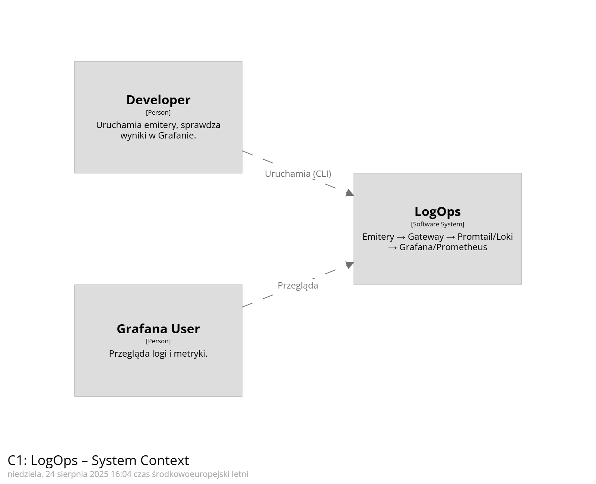

# Architektura LogOps

Dokument opisuje architekturę systemu LogOps z wykorzystaniem metodyki **C4 model**.  
Diagramy zostały przygotowane w [Structurizr DSL](https://structurizr.com/dsl) i uruchomione lokalnie za pomocą obrazu `structurizr/lite`.

---

## C1: System Context

Pokazuje głównych użytkowników i powiązane systemy zewnętrzne.  
Najważniejsze: deweloper uruchamia emitery, a użytkownik korzysta z Grafany do eksploracji logów.

**Diagram C1:**


---

## C2: Containers

Wnętrze systemu LogOps podzielone na kontenery.  
Emitery generują logi → Gateway normalizuje i udostępnia metryki → pliki NDJSON są zbierane przez Promtail i trafiają do Loki. Prometheus scrape’uje metryki, a Grafana umożliwia wizualizację.

**Diagram C2:**


---

## C3: Ingest Gateway – Components

Szczegółowy widok na komponenty w kontenerze **Ingest Gateway**.  
API przyjmuje logi, Parsers przekształcają dane, Normalizer ujednolica pola i obsługuje PII, a następnie dane mogą trafić do File Sink, Metrics Exportera lub triggerować Housekeeping.

**Diagram C3:**


---

## Generowanie diagramów

1. Uruchom Structurizr Lite lokalnie:
```powershell
docker run --rm -p 8081:8080 -v "${PWD}\docs\architecture:/usr/local/structurizr" structurizr/lite
```
2. Otwórz przeglądarkę: http://localhost:8081

3. Eksportuj diagramy do PNG/SVG (ikonka w górnym menu).

## Uwaga o Structurizr Lite

Structurizr Lite działa lokalnie w kontenerze Dockera i nie jest hostowany w repo.
Oznacza to, że inni użytkownicy nie otworzą linku typu http://localhost:8081 – muszą sami uruchomić kontener z repozytorium.
Dlatego w dokumentacji zawsze warto eksportować diagramy do PNG/SVG i trzymać je w repo (docs/architecture/).
